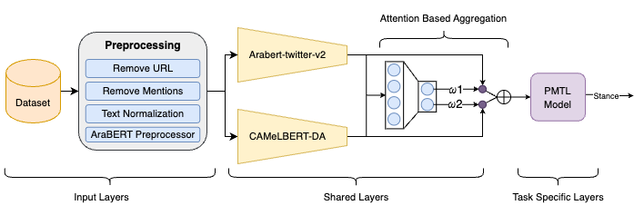

# Multi-Task Learning for Stance Detection (StanceEval2024)

<a href='https://sites.google.com/view/stanceeval/home?authuser=0'>Stance Detection in Arabic Language Shared Task - Part of the The Second Arabic Natural Language Processing Conference (ArabicNLP 2024) Co-located with ACL 2024</a>

The goal of this shared task is to propose models for detecting writers' stances (Favor, Against, or None) towards three selected topics (COVID-19 vaccine, digital transformation, and women empowerment). Participants can approach the stance detection task through single-task or multi-task learning (MTL). Single-task learning-based models depend only on the stance data for model development and training. MTL-based models can use other information, such as the sentiment and sarcasm of each tweet, to boost the performance of the stance detection system. 

## Approach

<br>

## Usage Instructions

* For training and testing, first clone this repository and enter into the root directory of the repository.

* Please note that the training and testing data is included in the repository in the `./data` folder.

<p style="color:red">Please note that the code is compatible with Linux and MacOS and has not been tested on a Windows system. If you are using Windows, you might run into issues with the model/data paths in the code.</p>

### Training

This `main.py` script provides a command-line interface with the following arguments:

- `-model`: Choose between 'parallel' or 'sequential' for the model type. Default is 'parallel'.
- `-first`: Specify 'sarcasm' or 'sentiment' for the first task. Default is 'sentiment'. Skip this option if using parallel model.
- `-es`: Set the ensemble setting using the following options:
  - 0: ENSEMBLE_AVERAGE
  - 1: ENSEMBLE_ATTENTION
  - 2: ENSEMBLE_GRAPH
- `-ws`: Set the weighting setting using the following options:
  - 0: EQUAL_WEIGHTING
  - 1: STATIC_WEIGHTING
  - 2: RELATIVE_WEIGHTING
  - 3: HEIRARCHICAL_WEIGHTING
- `-bert`: Provide a list of indices (0, 1, 2, and/or 3) for BERT models. Example, you can provide multiple bert models: 013
  - 0: "aubmindlab/bert-base-arabertv02-twitter"
  - 1: "aubmindlab/bert-base-arabertv02"
  - 2: "UBC-NLP/MARBERT"
  - 3: "CAMeL-Lab/bert-base-arabic-camelbert-da"
- `-pool`: Choose between 0 or 1 for pooling. This variable decides whether the BERT output is pooled or not; whether we will use LSTM or not. 1 implies that LSTM will not be used. Default is 1.
- `-bi`: Set to 0 or 1 to enable or disable bidirectional processing. Default is 0 (disabled).
- `-gru`: Set to 0 or 1 to enable or disable GRU usage. 1 implies that GRU wlll be used instead of LSTM. Default is 0 (disabled).
- `-dlc`: Drop low confidence rows for sarcasm and sentiment from training data. Default is 0, ie, they will not be dropped.
- `-device`: Choose between 'cuda', 'mps' or 'cpu' for the computing device. Default is 'cuda'.

Example usage:

``` python src/main.py -model sequential -first sentiment -es 2 -ws 4 -bert 0123 -pool 1 -bi 1 -gru 0 -device cuda ```

### Testing

1. Create a `models` folder in the root directory
a. The folder structure should be: ```MawqifStanceDetection (root folder) -> src (folder), data (folder), models (folder), readme.md (file)```

2. Download our <a href='https://www.kaggle.com/datasets/gufransabri3/stanceeval-bestmodel'>best model</a> and place in the models folder
a. <span style="color:red">Make sure you do not change the model name!!</span>

3. Run ```python3 src/test.py -model_path <model_path> -data_path <data_path> -save_pred <True|False>```
a. If `save_pred` is True, the results will be stored in the res folder which is automatically created.

